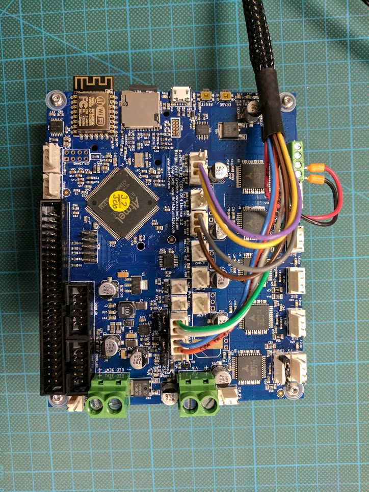
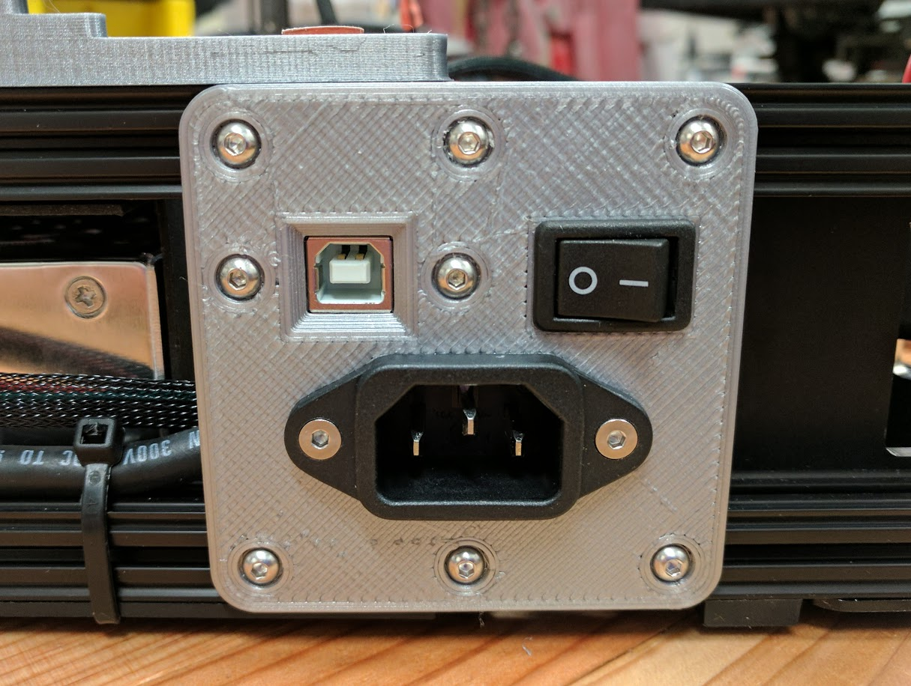

# Assembly

## Install Duet

**VERY IMPORTANT: Move the VFAN jumper to the 5v position.  24V will fry the LEDs in the end effector PCB!**

Tap the two holes around the fan mounting location with an M3 tap.  Install a 30mm fan using ???mm M3 bolts.  If this is a 24v fan, you will wire it to the PSU directly.  If it's a 5v fan, you can wire it to one of the always-on fan headers on the mainboard.

Install the Duet board onto it's mounting bracket with some M3 bolts and nuts.  Be sure to use the plastic washers included with the Duet to prevent shorting out the board.  You can now mount this assembly into the frame using two M3 x 6 bolts into the side of the lower rail between the X and Z towers.  Make sure to leave at least one nut in the rail on either side of this bracket to allow you to mount the cover later.

### Wiring

While you can just plug the wires into the Duet it is recommened that you cut off the old connectors and crimp on the connectors included with the Duet.

You must re-terminate one end of the end effector umbilical.  The connections on the Duet are sufficiently different that you can't just plug in.  See the image below for the correct pin connections.

## Power bulkhead
If you are going to install the USB extension cable then migrate the power inlet and switch to the new power bulkhead.  The remaining holes are for the USB extension.  Install it with two M3 screws or bolts.

The newly assembled bulkhead is installed on the lower rails between the Z vertex and the PSU air outlet.  This is different from the original layout.

## End effector
