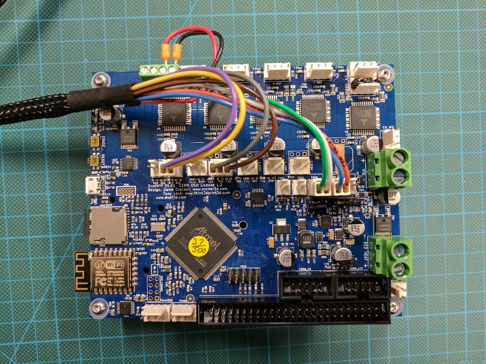

## Tools
The tools that came with your Kossel Pro will get you most of the way.  You'll also need to buy or borrow some specialized tools for terminating the wires for the new connections:

- [Ferrule Crimper with Ferrules](https://www.amazon.com/gp/product/B01K160CC8/)
- [Ratcheting crimp pliers](https://www.adafruit.com/product/1213)
- [Wire stripper](https://www.amazon.com/IRWIN-VISE-GRIP-Self-Adjusting-Stripper-2078300)

A 2.5mm drill and an M3 tap are also recommended for forming threads in the plastic parts.

## Print the parts

## Strip the printer
Unplug power first and let it sit a few minutes at least.

To ease disassebly, you can cut the power input and heated bed output wires right at the Brainwave Pro motherboard.  We will
re-use these wires with new ends on them during assembly.

Disassembly:
  Remove end effector
  Remove delta arms
  Remove print glass & heated bed
  Remove power inlet/switch bulkhead and wires to the PSU
  Disconnect all wires and remove Brainwave Pro mainboard
  Remove extruder cold end assembly

If you didn't add the extra m3 nuts to the lower frame rails as recommended in the assembly guide, then you'll need to go back
now and add them.  This is an exercise left to the reader, but turning the printer upside down and removing one rail at a time
can be helpful.

## Install Duet

**VERY IMPORTANT: Move the VFAN jumper to the 5v position.  24V will fry the LEDs in the end effector PCB!**

Tap the two holes around the fan mounting location with an M3 tap.  Install a 30mm fan using ???mm M3 bolts.  If this is a 24v fan, you will wire it to the PSU directly.  If it's a 5v fan, you can wire it to one of the always-on fan headers on the mainboard.

Install the Duet board onto it's mounting bracket with some M3 bolts and nuts.  Be sure to use the plastic washers included with the Duet to prevent shorting out the board.  You can now mount this assembly into the frame using two M3 x 6 bolts into the side of the lower rail between the X and Z towers.  Make sure to leave at least one nut in the rail on either side of this bracket to allow you to mount the cover later.

### Wiring

While you can just plug the wires into the Duet it is recommened that you cut off the old connectors and crimp on the connectors included with the Duet.

You must re-terminate one end of the end effector umbilical.  The connections on the Duet are sufficiently different that you can't just plug in.  See the image below for the correct pin connections.

